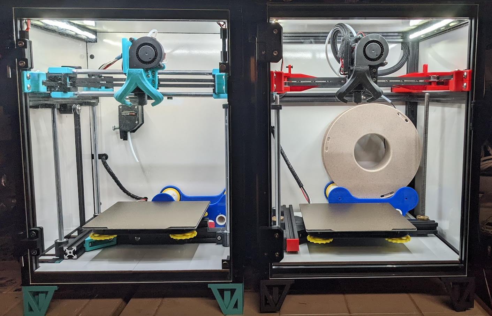

## What is the BBox?

The BBox started off as a personal project. The first few protoypes were "BBox180" printers meaning they had a 180x180x180 build volume.
The BBox180 is a small(ish), enclosed CoreXY printer with good performance characteristics. The main features are:

* CoreXY motion system
* Support for either dual leadscrews or dual belts for Z-drive
* Support for either linear rods or linear rail for X-axis
* Enclosed (but you don't have to if you don't want to)
    * This lets you easily print ABS and ASA type materials with great results
* Printer filament is stored within the enclosure
    * Helps keep the filament stay dray during printing
* Very simple but efficient toolhead
    * Uses Sherpa Mini extruder
        * A well proven design with mods/variants to make it easier to adapt an MMU such as the Basic4 or ERCF
    * Optionally, you could use a remote BMG type extruder with a bowden tube to the hotend
        * I ran a BBox180 like this for quite a while with very good results
    * Utilizes clone Bambu Labs X1C hotend for an excellent performance to cost ratio
        * Uses CHC style nozzle 
    * Uses single 5015 fan with "Claw" duct for excellent part cooling performance
* Excellent visibility to what you're printing
    * LED lighting with white interior panels make everything easy to see
    * No belts or extrusion at front of the printer to get in the way
    * Claw duct does not obscure the area around the nozzle so you see exactly how things are laying down
* Scalable design, can be built as large or small as you wish within reason
* Unique motor and belt path that is directly inspired from the one in Tim Wieder's CoreCubeXY project. While similar to Voron V0 belt path
it is not quite the same as the belt teeth face the back of the printer (mount against the X carriage).
    * No belts in front of the printer
    * Uses a total of 10 pulleys. This is at least 2 less than most other printers.

> Here's the original BBox180 prototype that I shared on YouTube mid 2023.  

That prototype utilized a variety of pre-existing parts and designs that allowed me to test my ideas out. I am super appreciative
of the very talented people who shared their work. Perhaps by sharing my BBox design I can also give back a little to the community.

Since that initial prototype I have designed my own custom parts using Fusion360 for the BBox. Doing this allowed me to level up my
(limited) CAD skills. I was also able to develop alternate X-axis and Z-axis motion systems. And more importantly, building my own parts
allowed me to re-implement the belt pathing found in [Tim Wieder's CoreCubeXY project](https://github.com/timwieder1509/CoreCubeXY) and adapt it into the BBox.
But mostly, by building my own custom designed parts, I was able to develop the BBox to be as simple and basic *as I wanted*.

> Here's a video short I made of the linear rail variant of the BBox

Below are some pics from Oct 2023 of two of my BBox 180 printers. The one on the left was the original prototype but rebuilt using all newly
designed parts for the X/Y motion system. Like the original prototype, this rebuild uses linear rods for the X-axis. However the BBox on the right 
uses an MGN12C linear rail for the X-axis. Also the BBox on the left uses an axle driven dual-belted Z (single motor) for the Z-axis while the BBox
on the right uses dual leadscrews (two motors). This is a good example of how the BBox is more of a platform rather than a specific printer design.
Use what you prefer, or what you can based on the parts you have available (hint: using a donor printer like a KP3S or Ender 3 is a great way to build a BBox).

> Speaking of donors.....using an existing printer such as a KP3S or an Ender 3 style printer is an excellent and cost effective way to build a BBox.
With the KP3S you can build a BBox180, with an Ender 3 type printer you can build a BBox235, etc. While you can certainly build a BBox from scratch, using
a donor printer will save you some money as well as speed up the build process.

In the picture above, the BBox180 on the left used a BMG clone extruder coupled with a bowden tube to the hotend. The BBox180 on the right used a Sherpa mini direct drive extruder. Both are options that provide very good performance. But for higher speeds (250mms) the BMG clone wasn't able to keep up, probably related to the much higher pressure advance that a bowden system requires versus direct drive. I later switched that printer over to also use a Sherpa mini direct drive extruder.

## Building a BBox
The BBox has not yet been released. It is about to enter a closed beta period to a limited number of users who can provide feedback, test the parts, etc so that when 
the BBox is released it will be a little more polished, easier to build, troubleshoot and also use.

In the meantime you are welcome to visit the documentation site for the BBox project

