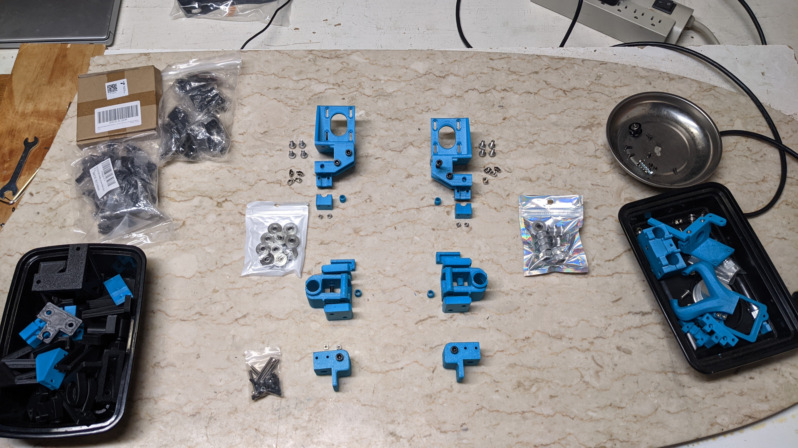

As previously mentioned, it is recommended to print the BBox parts with ABS or ASA filament.
This should be done with an enclosed printer when possible. However it may be possible to print
the parts in open air using some brands of ASA if you don't have drafts (or can rig up a simple draft shield).

If you decide not to enclose your BBox then it should be possible to print the parts with PLA. During the early
prototype stages of development I made many versions of the parts using PLA and they seemed to be okay. The only
area of concern I would have is that the motor mounts will deform when the motors get hot. To prevent that you
can dial down the run current so they don't get warm, but that will affect performance and possibly quality. 
It may be possible to print (just these) parts in PETG for their higher heat tolerance but I've heard that 
PETG can deform over time due to load/stress. I don't know if that would occur or not.

## Profile settings
Generally I like to print fast so I can test out my parts. This led me to using the following printing parameters
when I developed the BBox parts. They gave me the strength I needed and also shortened the print times by a little
compared to using Voron style print settings. So think of these as minimum settings; you can add more layers/walls
or increase the infill, etc.

* 0.2mm layer height
* 0.5mm line width
* 4 walls, 4 top layers, 4 bottom layers
* 15% infill density
* No supports needed

You can also use the Voron style print settings which are similar:

* 0.2mm layer height
* Forced 0.4mm extrusion width
* 4 walls, 5 layers for top, 5 layers for bottom
* 40% infill
* No supports needed

Or you could go the opposite direction and use a 0.25mm layer height for some parts to shorten the print time.
Do what makes you happy.

## Choosing which STL files to print
You'll need to decide if you'll be using the **linear rod** or **linear rail** variant of the BBox. The stl files
for both variants can be found in separate folders. So you can ignore the folders that don't apply.

Similarly, you can choose between the axle driven dual-belted Z-drive or the dual leadscrew Z-drive. The parts
for these two variants will also be in their respective folders. So only print the parts that apply to your choice.

Later on in this document I'll list out the folder names, the list of `.stl` files in the folder, and what
the parts are used for. This way you can decide which folder(s) to use and which to ignore as well as the orientation
of the parts when printing.

> Note: Some of the `.stl` files are meant to be printed more than once. These parts will have a suffix in their name
like `ZBearingClamp_x3.stl`. In this example the `_x3` means you'll need to print 3 copies of this part.

### Printed parts used for a BBox235 that uses linear rods for X axis

## Build plate pics
The following section shows the print orientation you should use for each part. The arrangement of
some of the parts in these build plates were adjusted to make things easier to see and may not be the
best arrangement for printing.

The build plates show the `.stl` parts for a specific folder. The folder name and the list of `.stl` part files
within it are listed before each build plate. 

### Folder: XYMotion/MotorAssembly
Always print this. Used by all variants of the BBox

* MotorAssemblyLeft.stl
* MotorAssemblyRight.stl
* MotorAssemblyRodClamp_x2.stl
* PulleySpacer_x2.stl

### Folder: XYMotion/FrontIdlers  
Always print this. Used by all variants of the BBox.
These are the front idlers of the CoreXY motion system.

* FrontIdlerLeftLower.stl
* FrontIdlerLeftUpper.stl
* FrontIdlerRightLower.stl
* FrontIdlerRightUpper.stl

### Folder: Toolhead  
Always print this. Used by all variants of the BBox.
These parts comprise the toolhead.

### Folder: XYMotion/XRod/Joiners
These parts should only be printed if you're using the **linear rods** for x-axis variant.
These parts form the section of the gantry that join the X-axis to slide along the Y-axis.

* EndStopBumperLeft.stl
* EndStopBumperRight.stl
* PulleySpacer_x2.stl
* XYJoinerXRodBottomLeft.stl
* XYJoinerXRodBottomRight.stl
* XYJoinerXRodLeft.stl
* XYJoinerXRodRight.stl
* XYJoinerXRodTopLeft.stl
* XYJoinerXRodTopRight.stl

If using sensorless homing for X-axis you can skip printing `EndStopBumperLeft.stl` and `EndStopBumperRight.stl`.
Otherwise you can choose to print just one of these parts depending on whether you want to home to the left side or the right side of your printer.

### Folder: XYMotion/XRod/Carriage
These parts should only be printed if you're using the **linear rods** for x-axis variant.
These pieces form the X-carriage that the toolhead will attach to.

### Folders: XYMotion/XRail/Joiners and XYMotion/XRail/Carriage_Basic  
These parts should only be printed if you're using the **MGN12C linear rail** for x-axis variant.

**The parts in `XYMotion/XRail/Joiners` form the section of the gantry that join the X-axis to slide along the Y-axis.**  
There are two sizes available; a +70mm variant and a +75mm variant. Choose the size that matches your desired
horizontal extrusion length. For example if you're building a BBox180 using a 225mm rail and you want to use 300mm extrusion
then use the +75mm parts listed below instead of the +70mm versions.

* XYJoinerLeft_75.stl
* XYJoinerRight_75.stl

As another example, say you want to build a BBox using a 250mm rail and want to use pre-cut 320mm extrusion, then you would use
the following parts instead:

* XYJoinerLeft_70.stl
* XYJoinerRight_70.stl

**The parts in `XYMotion/XRail/Carriage_Basic` form the X-carriage that the toolhead will attach to.** 

> Note: There is also an `XYMoton/XRail/Carriage_DragonBurner` folder with carriage parts that may work with Voron DragonBurner toolhead. These are still a work in progress and have only been briefly tested.

### Folder: XYMotion/EndStopY
This folder contains three different versions of an endstop mount for the Y axis. This is not needed if you will be using sensorless homing.

* EndStopY_Flat.stl
* EndStopY_Left.stl
* EndSotpY_Right.stl

No picture of a buildplate is provided as print orientation should be apparent and also you will only need to print one of these parts.

Choose `EndStopY_Flat.stl` if you're using linear rods for X-axis. You can use this part to mount an endstop switch on either the left or right side of the printer.

If using linear rail for X-axis then choose either `EndStopY_Left.stl` or `EndStopY_Right.stl` to mount the endstop depending on which side you prefer to mount your switch.

### Folder: ZDrive_Belted/AxleDrive
These parts should only be printed if you're using the dual-belted Z-drive variant.

* AxleBearingSupport_x2.stl
* Z_Motor_Mount.stl
* ZIdlerPulley_x2.stl

### Folder: ZDrive_Platform  
Always print this. Used by all BBox variants.
The corner clamp parts are used to form the T platform while the other parts are used to support the motion of that platform up and down the Z axis.
The printer bed will mount onto this T platform.

* CornerClamp_40mm_x2.stl
* ZBearingClamp_x3.stl
* ZRodClampAligned_x6.stl
* ZSwitchMountOneSided.stl
* ZSwitchPlate.stl

### Folder: ZDrive_Belted/Clamps
These parts should only be printed if you're building the dual-belted Z-drive variant.
These are the parts that clamp the ends of each belt and the mounts that attach the clamp the T platform.

* ClampMountParallel_Heatsets.stl
* ClampMountParallel_SquareNuts.stl
* ClampMountPerpendicular.stl
* SlidingClamp_Parallel.stl
* SlidingClamp_Perpendicular.stl
* StationaryClamp_Parallel.stl
* StationaryClamp_Perpendicular.stl

### Folder: ZDrive_LeadScrew
These parts should only be printed if you're building the dual leadscrew variant

* LeadScrewNutMount.stl
* LeadScrewNutMountOffset.stl
* ZMotorMount_x2.stl

### Folder: Toolhead - BambuX1_V6.stl only  
Always print this part. It is used by all variants of the BBox. 
This part is used to adapt a clone Bambu Labs X1C hotend to the V6 (J-Head) hotend mount.
This is the only part where supports (on build plate only) are recommended. If you print 
very slow you might not need the supports. You will want to prevent supports from being
generated in/around the "block" area of the adapter. 

* BambuX1_V6.stl  

