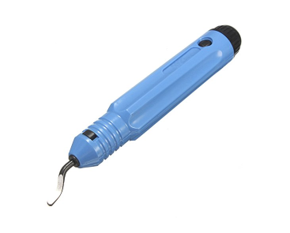

You'll need patience at times, as well as perseverence. But know that you'll be rewarded. As stated earlier you will need to think through some things as the BBox isn't
a project where every step is precisely layed out like a Lego kit. You will have options to choose from. So have fun!

## A list...
Okay...here is a higher level list of what you'll need.

* **The ability to cut 8mm linear rods to length is absolutely necessary if you are using linear rods for X axis**. The Y axis will also use linear rods for both BBox variants. It is also recommended to cut these 8mm linear rods as well but it might be possible to use full length rods (300mm for BBox180, 350mm for BBox235). I will describe this in more detail (with a video) soon.
* A way to print the BBox parts in ABS/ASA. If you aren't going to enclose the BBox then it should be okay to print with PLA. A few prototypes of the BBox180 used PLA just fine. It may also be possible to build a semi-enclosed BBox in PLA (don't use a top cover) and then reprint the parts in ABS/ASA and rebuild it or make another fully enclosed printer.
* A donor 3D printer is recommended to make the build go faster and easier but is not required. You can always source the parts individually.
* A single board computer of some kind to host Klipper. This is usually a Raspberry Pi. You can also modify a Chromebox or Chromebook or an old laptop to run linux; these work really well.

## A list of tools
You'll want or need various tools

* A soldering iron or other way to install heated inserts. A soldering iron is pretty useful anyways should you need to bridge the solder pads on a KP3S mainboard, or to solder wires/connections.
* Allen wrenches (hex keys) to drive M3 and M5 screws.
* Side cutters
* Wire stripper
* Wire crimpers for JST connectors. If you choose not to use connectors for some parts you may be able to just cut/splice/solder/heatshrink wires together and skip this tool.
* A flat surface to assemble the frame on. I describe this in more detail later but it is needed to ensure the frame is square. This can be as simple as a countertop or glass table, etc.
* A large framing square will help ensure the frame is assembled squarely
* A combination square (regular size and also a smaller size) will be incredibly useful. I often use this as a gauge to ensure distances are the same, however you can also just use anything that you can set the length of (cut some wood, or some chopsticks from your takeout meal, etc)
* A deburring tool isn't necessary but can be pretty handy at times 

## Bill of materials (BOM)
***This is still a work in progress.*** 

You can read it below or you can also click on the following link to open the BOM sheet in another window/tab:
<a href="https://docs.google.com/spreadsheets/d/e/2PACX-1vQDiXYJ0-16EVXWmls1pwyG7v293kObzh3YiX_eZF4wSI8NvtWz2h5ljj5gdv8VWFYyUxMG24Bgv_YX/pubhtml" target="_blank">BBox BOM</a>

<iframe src="https://docs.google.com/spreadsheets/d/e/2PACX-1vQDiXYJ0-16EVXWmls1pwyG7v293kObzh3YiX_eZF4wSI8NvtWz2h5ljj5gdv8VWFYyUxMG24Bgv_YX/pubhtml" frameborder="0" width="100%" height="600" scrolling="no"></iframe>

